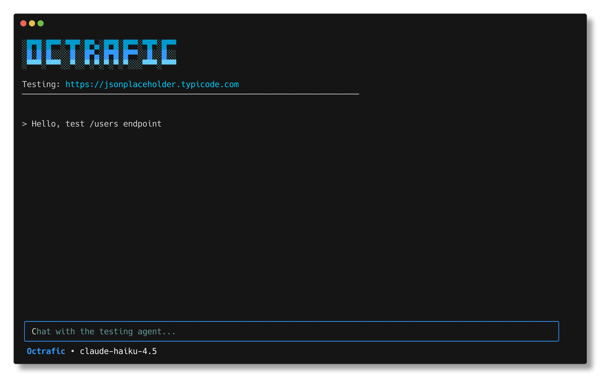

<p align="center">
  
</p>

<h1 align="center">Octrafic</h1>

<p align="center">
  AI-powered CLI tool for API testing and exploration.<br/>
  Chat naturally with your APIs - no scripts, no configuration files, just conversation.
</p>

<p align="center">
  <a href="https://docs.octrafic.com"><strong>Documentation</strong></a>
</p>

<p align="center">
  <a href="https://github.com/Octrafic/octrafic-cli/releases"></a>
  <a href="https://github.com/Octrafic/octrafic-cli/blob/main/go.mod"></a>
  <a href="https://github.com/Octrafic/octrafic-cli/blob/main/LICENSE"></a>
  <a href="https://goreportcard.com/report/github.com/Octrafic/octrafic-cli"></a>
</p>



## Features

- **Natural language testing** - Describe what you want to test, AI generates the right requests
- **Intelligent exploration** - Ask questions about endpoints, parameters, and responses
- **Automated test generation** - Comprehensive test suites based on your API specs
- **Multiple AI providers** - Claude, OpenRouter, OpenAI, Ollama, llama.cpp
- **Flexible authentication** - Bearer tokens, API keys, Basic auth with secure credential handling
- **Format support** - OpenAPI/Swagger (JSON/YAML), Postman Collections, GraphQL, Markdown

## Quick Start

### Install

**Linux & macOS:**
```bash
curl -fsSL https://octrafic.com/install.sh | bash
```

**Windows (PowerShell):**
```powershell
iex (iwr -useb https://octrafic.com/install.ps1)
```

**macOS (Homebrew):**
```bash
brew install octrafic/tap/octrafic
```

**Arch Linux:**
```bash
yay -S octrafic-bin
```

**Other options:** See [INSTALL.md](INSTALL.md) for package managers (DEB, RPM) and manual installation

### Setup

On first launch, configure your AI provider:

**Supported providers:**
- **Claude** - [console.anthropic.com](https://console.anthropic.com)
- **OpenRouter** - [openrouter.ai/keys](https://openrouter.ai/keys)
- **OpenAI** - [platform.openai.com](https://platform.openai.com)
- **Ollama** (local) - [ollama.com](https://ollama.com)
- **llama.cpp** (local) - [github.com/ggml-org/llama.cpp](https://github.com/ggml-org/llama.cpp)

Configuration is saved in `~/.octrafic/config.json`

### Usage

```bash
# Start interactive mode - browse projects or create new
octrafic

# Quick start with API spec
octrafic -u https://api.example.com -s openapi.json

# Create named project (saves automatically)
octrafic -u https://api.example.com -s spec.json -n "My API"

# Resume saved project
octrafic -n "My API"
```

## Authentication

**Your credentials never leave your machine** - they're sent only to your API, not to AI providers.

### CLI Flags

```bash
# Bearer token
octrafic -u https://api.example.com -s spec.json --auth bearer --token "TOKEN"

# API key
octrafic -u https://api.example.com -s spec.json --auth apikey --key "X-API-Key" --value "KEY"

# Basic auth
octrafic -u https://api.example.com -s spec.json --auth basic --user "user" --pass "pass"
```

### Environment Variables

For safer credential management, use environment variables instead of CLI flags:

```bash
# Bearer token
export OCTRAFIC_AUTH_TYPE=bearer
export OCTRAFIC_AUTH_TOKEN=my-secret-token
octrafic -u https://api.example.com -s spec.json

# API key
export OCTRAFIC_AUTH_TYPE=apikey
export OCTRAFIC_AUTH_KEY=X-API-Key
export OCTRAFIC_AUTH_VALUE=my-api-key
octrafic -u https://api.example.com -s spec.json

# Basic auth
export OCTRAFIC_AUTH_TYPE=basic
export OCTRAFIC_AUTH_USER=username
export OCTRAFIC_AUTH_PASS=password
octrafic -u https://api.example.com -s spec.json
```

**Priority:** CLI flags override environment variables, which override saved project auth.

Auth is saved automatically with named projects (`-n`). Change during session with `/auth` command.

## Example Session

```bash
octrafic -u https://jsonplaceholder.typicode.com -s api-spec.json

> what endpoints are available?
AI: This API has 5 main endpoints: /posts, /users, /comments...

> test the users endpoint
AI: I'll test GET /users [executes test and shows results]

> create a new post with title "Hello World"
AI: I'll send a POST request to /posts... [shows result]
```

## Commands & Navigation

**Chat commands:** `/help` `/auth` `/info` `/think` `/clear` `/exit`

**Keyboard:** `↑/↓` command history · `Page Up/Down` scroll · `Esc Esc` clear input · `Ctrl+C` exit

## Project Structure

```
octrafic/
├── cmd/octrafic/          # Main entry point
├── internal/
│   ├── agents/            # AI agent logic and system prompts
│   ├── cli/               # Terminal UI (Bubble Tea)
│   ├── core/              # Parser, test generator, validator
│   ├── infra/             # Storage, logger
│   └── llm/               # LLM client wrappers (Claude, OpenRouter, OpenAI, Ollama, llama.cpp)
├── docs/                  # Documentation (VitePress)
└── README.md
```

## Contributing

Contributions are welcome! See [CONTRIBUTING.md](CONTRIBUTING.md) for guidelines.

## License

MIT - see [LICENSE](LICENSE)
