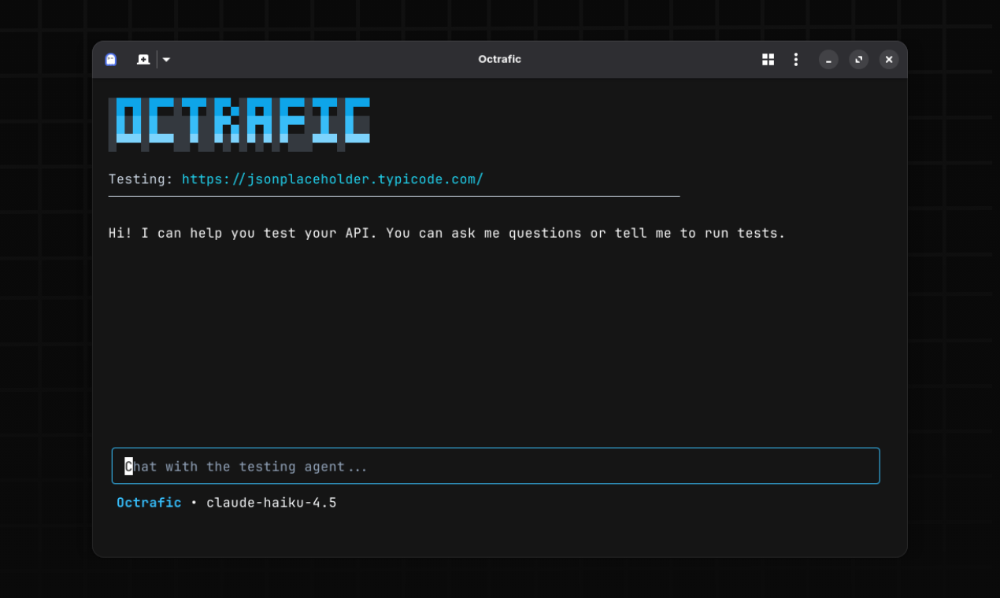

[](https://golang.org/)
[](https://opensource.org/licenses/MIT)

Open source CLI tool for automated API testing and reporting. Test your APIs by describing what you want in natural language.

## Install

**Linux & macOS:**
```bash
curl -fsSL https://octrafic.com/install.sh | bash
```

**macOS (Homebrew):**
```bash
brew install octrafic/tap/octrafic
```

**Windows:**
```powershell
iex (iwr -useb https://octrafic.com/install.ps1)
```

## Quick Start

```bash
octrafic
```

## Documentation

**Getting Started**
- [Introduction](https://docs.octrafic.com/getting-started/introduction)
- [Quick Start](https://docs.octrafic.com/getting-started/quick-start)

**Guides**
- [Chat Features](https://docs.octrafic.com/guides/chat-features)
- [Project Management](https://docs.octrafic.com/guides/project-management)
- [Providers](https://docs.octrafic.com/guides/providers)
- [Authentication](https://docs.octrafic.com/guides/authentication)
- [PDF Reports](https://docs.octrafic.com/guides/reports)
- [Exporting Tests](https://docs.octrafic.com/guides/exports)
- [Headless Mode](https://docs.octrafic.com/guides/headless)

## Contributing

Contributions are welcome! See [CONTRIBUTING.md](CONTRIBUTING.md) for guidelines.

## License

MIT - see [LICENSE](LICENSE)
