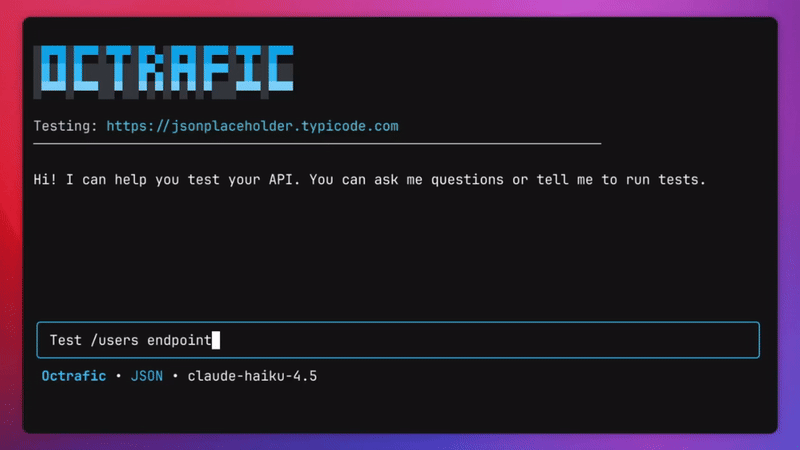

# Octrafic

[](https://golang.org/)
[](https://opensource.org/licenses/MIT)
[](...)
[](...)

Open source CLI tool for automated API testing and reporting. Test your APIs by describing what you want in natural language.



> If you find Octrafic useful, please ⭐ **[star the repo](https://github.com/Octrafic/octrafic-cli)** - it helps a lot!

## Features

- **Natural language testing** - describe what you want to test in plain English; the agent generates and executes the test plan
- **OpenAPI Scanner** - scan your application source code to automatically generate OpenAPI 3.1 specifications
- **Broad spec support** - OpenAPI 3.x, Swagger 2.0, Postman Collections, GraphQL, and Markdown docs
- **Multiple auth methods** - Bearer token, API Key, Basic Auth, or none
- **Export tests** - generate Postman collections, Python pytest files, or Bash curl scripts from any test session
- **PDF reports** - produce professional test reports with a single command (requires `weasyprint`)
- **Multiple LLM providers** - Anthropic Claude, OpenAI, Google Gemini, OpenRouter, Ollama, llama.cpp, or any OpenAI-compatible endpoint
- **Headless / CI mode** - run non-interactively with `octrafic test` for pipeline integration

## Install

**Linux & macOS:**
```bash
curl -fsSL https://octrafic.com/install.sh | bash
```

**macOS (Homebrew):**
```bash
brew install octrafic/tap/octrafic
```

**Windows:**
```powershell
iex (iwr -useb https://octrafic.com/install.ps1)
```

## Quick Start

```bash
octrafic
```

## Documentation

**Getting Started**
- [Introduction](https://docs.octrafic.com/getting-started/introduction.html)
- [Installation](https://docs.octrafic.com/getting-started/installation.html)
- [Quick Start](https://docs.octrafic.com/getting-started/quick-start.html)

**Guides**
- [Chat Features](https://docs.octrafic.com/guides/chat-features.html)
- [OpenAPI Scanner](https://docs.octrafic.com/guides/scanner.html)
- [Project Management](https://docs.octrafic.com/guides/project-management.html)
- [Providers](https://docs.octrafic.com/guides/providers.html)
- [Authentication](https://docs.octrafic.com/guides/authentication.html)
- [PDF Reports](https://docs.octrafic.com/guides/reports.html)
- [Exporting Tests](https://docs.octrafic.com/guides/exports.html)
- [Headless Mode](https://docs.octrafic.com/guides/headless.html)

## Contributing

Contributions are welcome! See [CONTRIBUTING.md](CONTRIBUTING.md) for guidelines.

## License

MIT - see [LICENSE](LICENSE)
